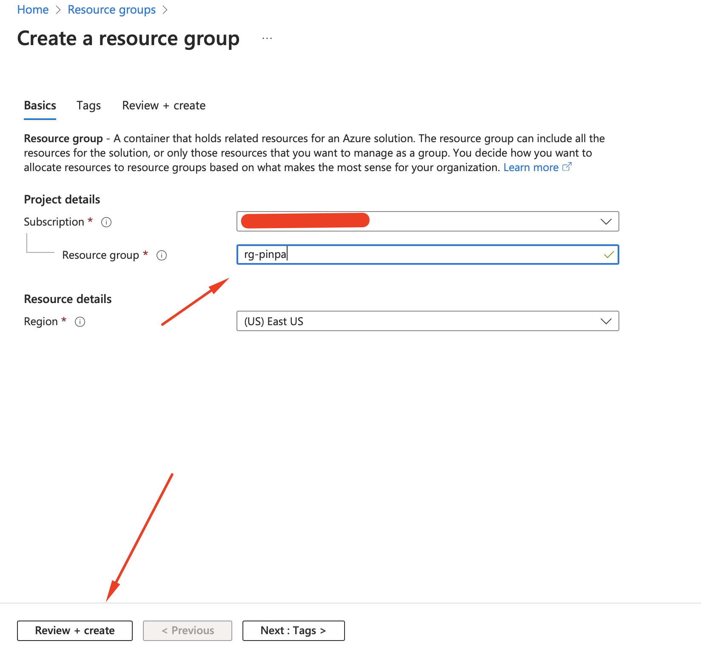
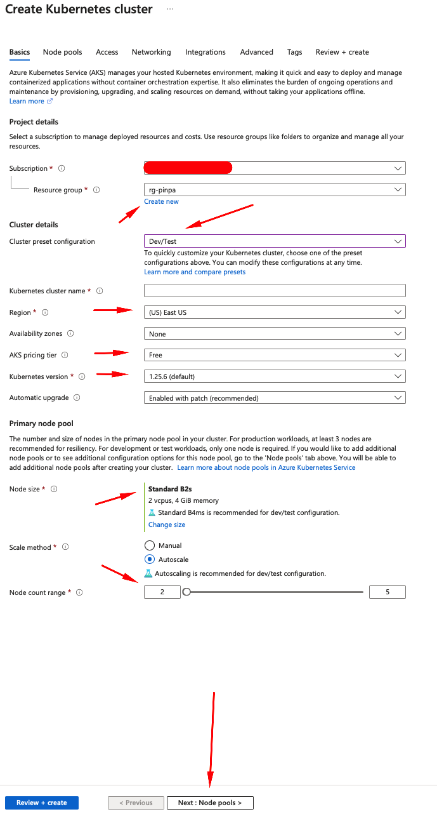
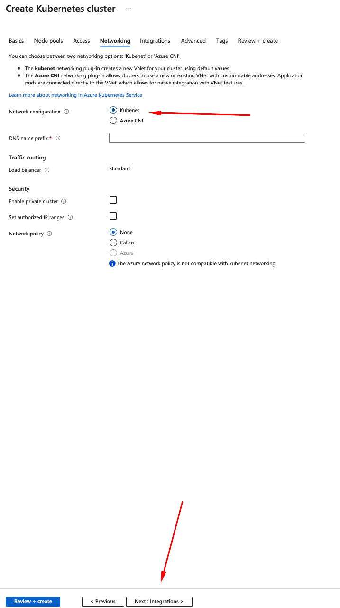
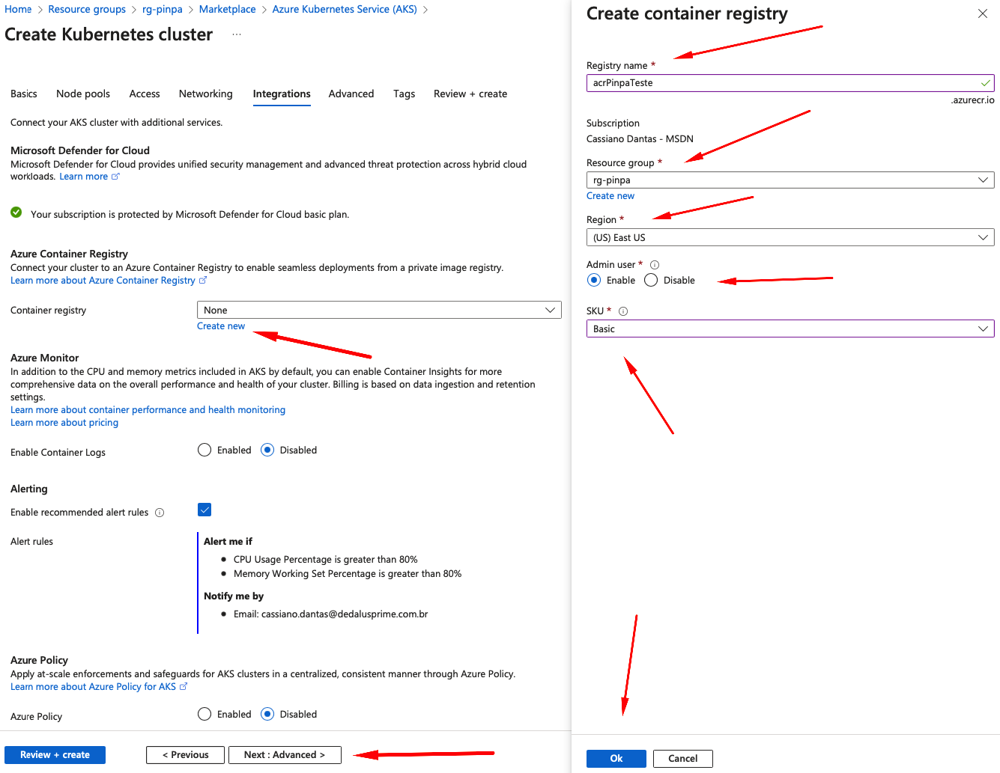
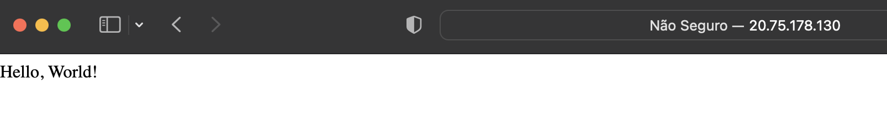

# Course_k8s
Repositório dos Exercicios e Atividades do curso de kubernetes
___
Introdução
----------------
----------------

Este hands-on é um guia prático que tem como objetivo introduzir você ao Kubernetes, uma das ferramentas mais populares e poderosas para orquestração de containers. Aqui, você aprenderá passo a passo como criar e gerenciar um cluster Kubernetes no Azure, criar e escalar deployments, daemonsets e statefulsets, configurar um ingress controller com certificado TLS, e muito mais.

Você começará instalando o Azure CLI, criando um cluster AKS no Azure e configurando o Kubeconfig para acessar o cluster. Em seguida, você aprenderá sobre os conceitos básicos do Kubernetes, como o que é um pod e como criar um pod em YAML.

Depois disso, você aprenderá sobre o conceito de service, e como criar um service em YAML. Também discutiremos a diferença entre os tipos de serviços NodePort, ClusterIP e Load Balancer.

Em seguida, você aprenderá sobre o deployment, um objeto do Kubernetes que gerencia um conjunto de réplicas de pods. Você criará um deployment em YAML e aprenderá a configurar a escalabilidade do seu aplicativo.

Além disso, exploraremos o conceito de daemonset e statefulset, que permitem que você execute um conjunto de pods em cada nó do seu cluster, e que os pods tenham um identificador persistente, respectivamente.

Também veremos como criar e gerenciar ConfigMaps e Secrets, objetos que permitem que você armazene e gerencie dados sensíveis e configurações em seu cluster.

Por fim, você aprenderá a instalar e configurar o ingress controller nginx-ingress com o Helm e aplicar um certificado TLS usando o cert-manager.

Este hands-on é destinado a iniciantes no Kubernetes e pressupõe que você tenha conhecimento básico de containers e do ambiente de linha de comando. Se você está procurando uma introdução prática e completa ao Kubernetes, este guia é uma excelente maneira de começar.
___
Pré-requisitos
---
---


 Antes de começar este hands-on, você precisará ter alguns pré-requisitos instalados e configurados em seu ambiente. Aqui estão os requisitos:

1. Conhecimento básico de containers e do ambiente de linha de comando
2. Uma conta do Azure
3. O Azure CLI instalado em sua máquina. Você pode instalar o Azure CLI seguindo as instruções em https://docs.microsoft.com/en-us/cli/azure/install-azure-cli
4. Um editor de texto, como o Visual Studio Code, instalado em sua máquina
5. O kubectl, a ferramenta de linha de comando do Kubernetes, instalado em sua máquina. Você pode instalar o kubectl seguindo as instruções em https://kubernetes.io/docs/tasks/tools/install-kubectl/
6. O Helm, o gerenciador de pacotes do Kubernetes, instalado em sua máquina. Você pode instalar o Helm seguindo as instruções em https://helm.sh/docs/intro/install/
7. Instale o git para poder clonar os exercicios e exemplos.

Certifique-se de ter todas essas ferramentas instaladas e configuradas corretamente antes de começar o hands-on.
___
Sobre Kubernetes
-------------------
-------------------

Kubernetes é uma plataforma de orquestração de contêineres open source, projetada para automatizar a implantação, escalabilidade e gerenciamento de aplicativos em contêineres. Ele foi desenvolvido pelo Google e agora é mantido pela Cloud Native Computing Foundation (CNCF).

Com o Kubernetes, você pode implantar e gerenciar facilmente aplicativos contêinerizados em um ambiente de cluster, tornando mais fácil a orquestração de recursos e a gerência de infraestruturas de TI modernas.

Kubernetes é altamente escalável, permitindo que você gerencie clusters com milhares de nós e centenas de milhares de contêineres. Ele também é altamente configurável e personalizável, permitindo que você ajuste o sistema para atender às suas necessidades específicas.

Kubernetes usa um modelo declarativo para gerenciar a infraestrutura, permitindo que você defina o estado desejado do sistema em um arquivo YAML ou JSON e, em seguida, use o Kubernetes para aplicar essa definição ao ambiente de cluster. Isso torna mais fácil a implantação e gerenciamento de aplicativos, além de garantir que o estado do sistema seja consistente e previsível.

Em resumo, o Kubernetes é uma ferramenta poderosa e altamente flexível para orquestração de contêineres, que permite que você gerencie facilmente aplicativos em um ambiente de cluster, aumente a disponibilidade e a escalabilidade, além de garantir que o sistema esteja sempre em um estado consistente e previsível.
___
# Hands-on
___
Criar um AKS no Azure com container registry:
-----------------------
-----------------------

Neste momento precisamos primeiro criar no cluster kubernetes 

1. Faça login no portal do Azure.
2. Crie um novo grupo de recursos.
    - Nome : rg-pinpa
    - Region: East US 
    - Manter o padrão nos demais itens
<br/>
3. Procure "AKS" na pesquisa e clique em "Criar".
    - Resource Group: rg-pinpa
    - Cluster Preset Configuration: Dev/Test
    - Kubernetes Cluster Name: eks-pinpa
    - Region: East Us
    - AKS princing tier: free
    - Kubernetes Version: 1.25.6
    - Node Size: B2s
    - Node count range: 2
    - Manter o padrão nos demais itens
<br/>
4. Clique em Next: Node Pools
    - Mantenha o padrão
5. Clique em Next: Access
    - Mantenha o padrão
6. Clique em Next: Networking
    - Network configuration: kubenet
    - Manter o padrão nos demais itens
<br/>
7. Clique em Next: Intergrations
    - Container Registry: create new
        - Registry Name: acrPinpaXxx
        - Resource Group: Pinpa
        - Region: East US
        - Admin user: Enable
        - SKU: Basic
    - Manter o padrão para os demais itens
<br/>
8. Clique em Review + Create
9. Clique em create

A Criação do cluster leva alguns minutos.
___
Configurar o KubeConfig para acessar o Cluster
-----------------------
-----------------------
O Kubeconfig é um arquivo de configuração usado pelo kubectl para acessar um cluster Kubernetes. Ele contém informações sobre o cluster, como o endereço do servidor API do Kubernetes, a chave de acesso, o certificado de cliente e o contexto atual.

Veja Como podemos gerar via azure CLI:

1. Realize o login no Azure CLI
2. Assuma a sua subscription
```bash
$ az account set -s <subscrition_id>
```
3. Execute o seguinte comando
```bash
$ az aks get-credentials -n eks-pinpa -g rg-pinpa
```
4. Deverá apresentar um resultado parecido com esse
```bash
$ az aks get-credentials -n eks-pinpa -g rg-pinpa
Merged "eks-pinpa" as current context in /Home/MPinpa/.kube/config
```
5. Teste a conexao com o cluster executando o comando abaixo:
```bash
$ kubectl get nodes
NAME                                STATUS   ROLES   AGE   VERSION
aks-agentpool-15786537-vmss000000   Ready    agent   31m   v1.25.6
aks-agentpool-15786537-vmss000001   Ready    agent   31m   v1.25.6
```
Se os Nodes apareceu normalmente, funcionou perfeitamente bem.
___
Pod
-----------------------
-----------------------

Em Kubernetes, um pod é a menor unidade de implantação que pode ser criada e gerenciada na plataforma. Um pod é um ambiente de execução para contêineres e contém um ou mais contêineres que compartilham o mesmo espaço de rede e armazenamento. É importante notar que os contêineres em um pod são sempre executados no mesmo nó do cluster Kubernetes.

Os pods são geralmente usados para agrupar e gerenciar contêineres que trabalham juntos para oferecer um serviço. Por exemplo, um pod pode conter um contêiner com um aplicativo web e outro contêiner com um banco de dados usado pelo aplicativo. Esses contêineres compartilham o mesmo espaço de rede e armazenamento dentro do pod, permitindo que eles se comuniquem facilmente.

___
Criando Primeiro Pod
<br>
---
Para criar o primeiro pod precisamos gerar uma imagem de docker e enviar para o registry que criamos com o nome <b>acrPinpaXxx</b>

Exemplo 1 - Criando primeiro pod

1. Cria a imagem docker baseado no DockerFile.
```bash
docker build -t <Url do registry>/hello-world:latest .
```
2. Enviar imagem para o Registry
````bash
docker push <Url do registry>/hello-world:latest
````
3. Aplicar o yaml no cluster
````bash
Kubectl apply -f pod.yaml
````
4. Para validar se o pod funcionou execute o comando, a saida deve ser uma aparecida com a abaixo:
````bash
$ kubectl get pods
NAME           READY   STATUS         RESTARTS   AGE
my-flask-pod   1/1     Running        0          104s
````

___
Service
-----------------------
-----------------------
Um serviço é um objeto Kubernetes que define uma política de acesso para um conjunto de pods. Ele permite que os pods sejam acessados de forma consistente, independentemente de sua localização ou escala.

<b>Diferença de NodePort, ClusterIP e Load Balance:</b>

NodePort expõe o serviço em um número de porta estática em cada nó do cluster. ClusterIP cria um IP interno para o serviço para que possa ser acessado internamente no cluster. LoadBalancer cria um IP externo que permite que o serviço seja acessado de fora do cluster.

Exemplo 1 - Criando primeiro pod

1. Aplicar o yaml no cluster
````bash
Kubectl apply -f service.yaml
````
2. Para validar se o service funcionou execute o comando, a saida deve ser uma aparecida com a abaixo:
````bash
$ kubectl get svc
NAME               TYPE           CLUSTER-IP    EXTERNAL-IP     PORT(S)        AGE
kubernetes         ClusterIP      10.0.0.1      <none>          443/TCP        11h
my-flask-service   LoadBalancer   10.0.110.69   20.75.178.130   80:30589/TCP   2m50s
````

Se voce tentar rodar o IP que apareceu em seu terminal no navegador será apresentado um hello world na sua tela informando que funcionou perfeitamente bem.

<br/>

___
Deployment
-----------------------
-----------------------

um Deployment é um objeto que gerencia a implantação de um conjunto de Pods e assegura que eles estejam rodando de forma saudável. Um Deployment permite atualizações e rollbacks da aplicação sem tempo de inatividade, e também pode ser escalado automaticamente com base na carga de trabalho.

Quando você cria um Deployment, você define o número de réplicas que deseja executar e as especificações do Pod, como imagem, portas e variáveis de ambiente. O Kubernetes então cria o número definido de réplicas do Pod. Se uma das réplicas falhar, o Deployment automaticamente cria uma nova replica para substituí-la.

Para atualizar a aplicação, você pode simplesmente atualizar a imagem do contêiner no Deployment e o Kubernetes cuida de atualizar as réplicas com a nova imagem, de forma rolling update, garantindo que haja sempre um número mínimo de réplicas rodando para que não haja interrupção no serviço.

Exemplo 2 - Deployment

1. Aplicar o yaml no cluster
````bash
$ kubectl apply -f deploy.yaml
$ Kubectl apply -f service.yaml
````
2. Para validar se o service/deploy funcionou execute o comando, a saida deve ser uma aparecida com a abaixo:
````bash
$ kubectl get deploy
NAME                  READY   UP-TO-DATE   AVAILABLE   AGE
my-flask-app-deploy   2/2     2            2           40s
````
Veja que foi criado dois pods e eles subiram normalmente.
se rodar o get pods veremos que existirá dois pods com o mesmo nome.
`````bash
$ kubectl get pods
NAME                                   READY   STATUS    RESTARTS   AGE
my-flask-app-deploy-5f4494677b-l74wr   1/1     Running   0          2m15s
my-flask-app-deploy-5f4494677b-m5lqw   1/1     Running   0          2m15s
my-flask-pod                           1/1     Running   0          30m

$ kubectl get svc
NAME                      TYPE           CLUSTER-IP    EXTERNAL-IP     PORT(S)        AGE
kubernetes                ClusterIP      10.0.0.1      <none>          443/TCP        13h
my-flask-service          LoadBalancer   10.0.110.69   20.75.178.130   80:30589/TCP   78m
my-flask-service-deploy   LoadBalancer   10.0.33.138   20.246.184.46   80:32014/TCP   2m38s
`````
___
DaemonSet
-----------------------
-----------------------

Um DaemonSet é um objeto do Kubernetes que garante que um conjunto de Pods seja executado em todos os nodes de um cluster. Cada node executará exatamente uma instância do Pod gerenciado pelo DaemonSet.

Isso é útil para tarefas que precisam ser executadas em todos os nodes, como coletar logs, coletar métricas ou configurar os nodes. Outra vantagem é que quando um novo node é adicionado ao cluster, o DaemonSet automaticamente cria uma nova instância do Pod para esse node.

Exemplo 3 - Criando daemon set

1. Aplicar o yaml no cluster
````bash
$ kubectl apply -f daemonset.yaml
````
2. Para validar se o daemonset funcionou execute o comando, a saida deve ser uma aparecida com a abaixo:
````bash
$ kubectl get pods
NAME                  READY   UP-TO-DATE   AVAILABLE   AGE
my-flask-app-deploy   2/2     2            2           40s
$ kubectl get daemonset
NAME           DESIRED   CURRENT   READY   UP-TO-DATE   AVAILABLE   NODE SELECTOR   AGE
my-daemonset   2         2         2       2            2           <none>          13s
$ kubectl get pods
NAME                                   READY   STATUS    RESTARTS   AGE
my-daemonset-fbcdn                     1/1     Running   0          3m29s
my-daemonset-qjqm2                     1/1     Running   0          3m29s
my-flask-app-deploy-5f4494677b-l74wr   1/1     Running   0          16m
my-flask-app-deploy-5f4494677b-m5lqw   1/1     Running   0          16m
my-flask-pod                           1/1     Running   0          45m
$ kubectl get nodes
NAME                                STATUS   ROLES   AGE   VERSION
aks-agentpool-15786537-vmss000000   Ready    agent   13h   v1.25.6
aks-agentpool-15786537-vmss000001   Ready    agent   13h   v1.25.6
````
___
StateFulSet
-----------------------
-----------------------
Um StatefulSet é um objeto do Kubernetes usado para gerenciar um conjunto de Pods que precisam ser executados em ordem específica e possuem um identificador único.

Os Pods gerenciados por um StatefulSet têm nomes diferentes e são persistentes, o que significa que eles retêm seus nomes e identidades únicas mesmo quando são removidos ou reiniciados. Isso é importante para aplicativos que precisam armazenar dados persistentes em disco ou para aplicativos que precisam de identificadores únicos, como bancos de dados, caches e outros sistemas de armazenamento de dados.

Exemplo 4 - Criando StatefulSet

1. Aplicar o yaml no cluster
````bash
$ kubectl apply -f deploy.yaml
$ Kubectl apply -f service.yaml
````
2. Para validar se o service/deploy funcionou execute o comando, a saida deve ser uma aparecida com a abaixo:
````bash
$ kubectl get deploy
NAME                  READY   UP-TO-DATE   AVAILABLE   AGE
my-flask-app-deploy   2/2     2            2           40s
````
Veja que foi criado dois pods e eles subiram normalmente.
se rodar o get pods veremos que existirá dois pods com o mesmo nome.
`````bash
$ kubectl get pods
NAME                                   READY   STATUS    RESTARTS   AGE
my-flask-app-deploy-5f4494677b-l74wr   1/1     Running   0          2m15s
my-flask-app-deploy-5f4494677b-m5lqw   1/1     Running   0          2m15s
my-flask-pod        